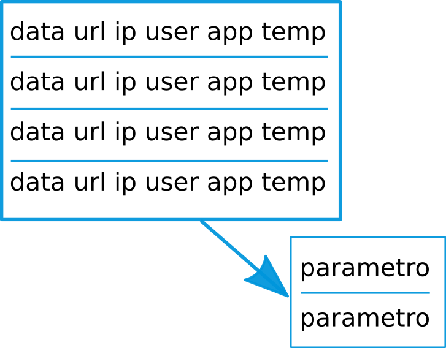
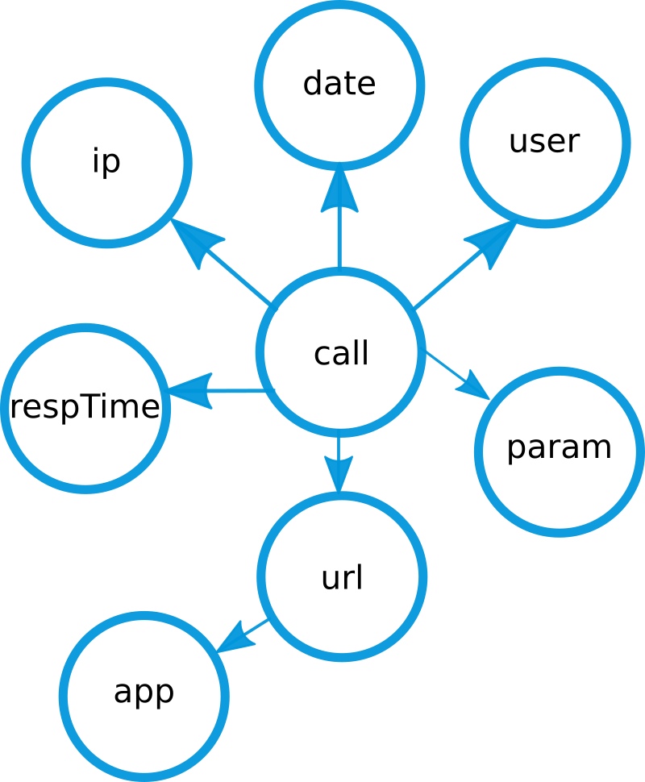
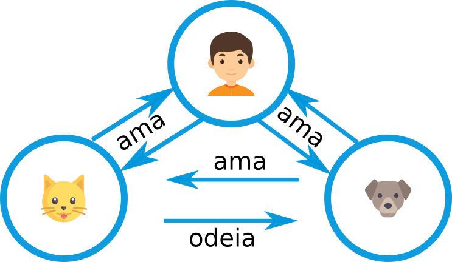
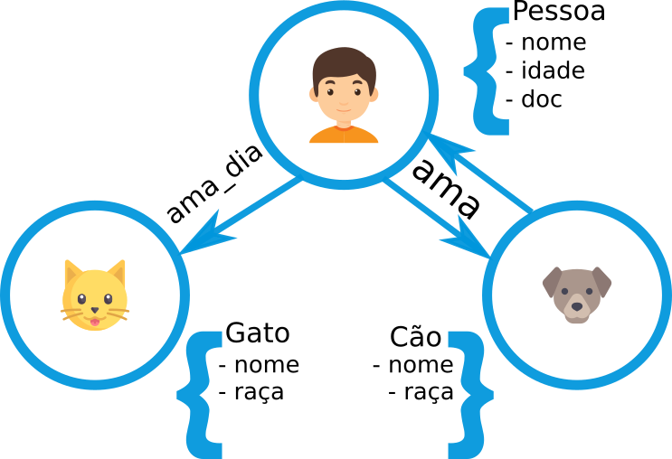
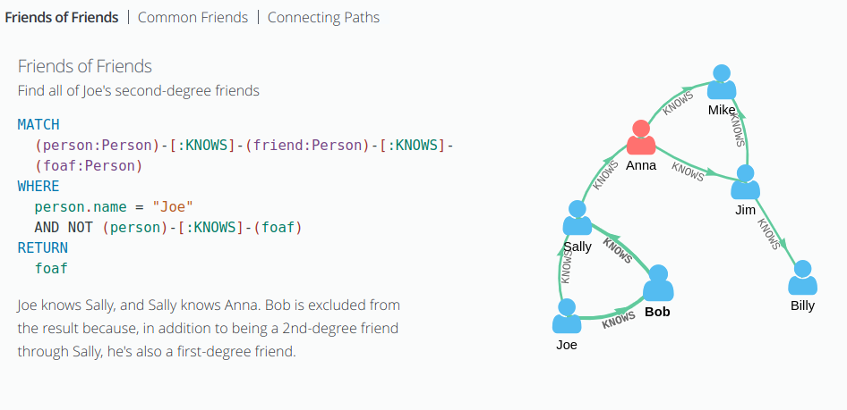

testando alterações

# Prática - Neo4j


Pense no seguinte cenário: Você elaborou uma aplicação extremamente segura, mas, como parte desta segurança fez um sistema de logs capaz de armazenar grande parte dos estados da aplicação.


----


## Problema

Ter uma grande massa de dados é algo muito bom, desde que você nunca precise dela...

----

## Dados armazenados


----

## Perguntas - Parte 1

* Qual ip um determinado usuário utilizou para acessar um app específico?
* Quais usuários utilizaram um ip?
* Quais serviços foram utilizados de uma aplicação?

----

## Perguntas - Parte 2

* Qual o maior tempo de resposta de uma requisição?
* Qual serviço é o mais 'pesado' de uma aplicação?
* Quais são os parâmetros passados para um serviço?


----

## Como ficaria em SQL ?



----

## Como ficaria utilizando grafo?




----


## Como armazenar esta etrutura ?

Vamos utilizar o banco [Neo4j](https://neo4j.com/developer/).

----

## Como funciona ?

<iframe width="800" height="450" src="https://www.youtube.com/embed/-dCeFEqDkUI" frameborder="0" allow="autoplay; encrypted-media" allowfullscreen></iframe>

----

## Neo4j - Relacionamentos




----


## Neo4j - Propriedades




----

## Neo4j - Instalação


```

$ docker run --publish=7474:7474 --publish=7687:7687  --volume=$HOME/neo4j/data:/data  --volume=$HOME/neo4j/logs:/logs  neo4j:3.0

```

----

## Neo4j - Cypher

A linguagem [Cypher](https://neo4j.com/docs/developer-manual/current/cypher/) é uma linguagem para a manipulação de grafos, ela possui uma sintaxe simples e intuitiva.


----


## Neo4j - Inserção de Dados

```

CREATE (n:Person { name: 'Andres', title: 'Developer' })

```

----


## Neo4j - Buscas



----

## Neo4j - Questões

Qual ip um determinado usuário utilizou para acessar um app específico?

```

MATCH (user:Usuario) -[:usuario_request] -> (call:Requisicao) <- [:aplicacao_request] - (apl:Aplicacao) ,
      (ip:IP) - [ip_request] -> (call)
WHERE user.idUsuario = '240' AND apl.idAplicacao = '1544'
RETURN user,apl

```

----

## Neo4j - Questões

Quais usuários utilizaram um ip?

```

## Encontrar um ip que foi possui mais de uma requisição

MATCH (n:IP) - [r:ip_request] -> () WHERE n.ip = '24.82.53.89' return n, count(r)

MATCH (user:Usuario) -[:usuario_request] -> (call:Requisicao) <- [:ip_request] - (ipr:IP)
WHERE ipr.ip = '24.82.53.89'
RETURN user,ipr

```

----

## Neo4j - Questões

Quais serviços foram utilizados de uma aplicação?

```

MATCH (url:URL) -[:url_request] -> (call:Requisicao) <- [:aplicacao_request] - (apl:Aplicacao)
WHERE apl.idAplicacao = '1544'
RETURN url, apl

```

----

## Neo4j - Questões

Qual o maior tempo de resposta de uma requisição?

```

MATCH (call:Requisicao)
RETURN max(call.tempo)

```

----

## Neo4j - Questões

Qual serviço é o mais 'pesado' de uma aplicação?

```

MATCH (url:URL) -[:url_request] -> (call:Requisicao) <- [:aplicacao_request] - (apl:Aplicacao)
WHERE apl.idAplicacao = '1544'
RETURN max(call.tempo)

```

----

## Neo4j - Questões

Quais são os parâmetros passados para um serviço?

```

# Todos os serviços

MATCH (url:URL) -[:url_request] -> (call:Requisicao) <- [:resp_request] - (par:Parametro)
RETURN url,par

# Um serviço específico

MATCH (url:URL) -[:url_request] -> (call:Requisicao) <- [:resp_request] - (par:Parametro)
WHERE url.url = '/fugit/quisque'
RETURN url,par

```
